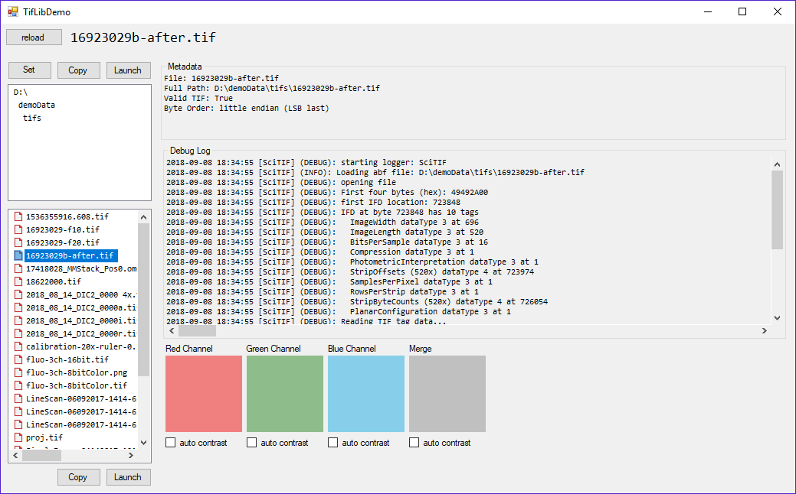

# SciTIF

**SciTIF provides an interface to microscopy data saved in TIF files.** Many TIF file reading libraries already exist, however it is not always clear how they treat uncommon TIF formats which are commonly used in _scientific_ microscopy (e.g., mult-channel multi-layer stacks of 12-bit data arranged little endian in a 16-bit TIF files). 

**An extremely common limitation of existing libraries is the lack of ability to scale a display LUT to nonstandard bit depths.** Most TIF libraries scale to 8-bit, 16-bit, and 32-bit images. However, scientific cameras attached to microscopes typically produce 10-bit, 12-bit, and 14-bit images. One example of a poor TIF library is the one used by Windows to produce thumbnails in Explorer, which presents 16-bit TIFs containing 12-bit data as nearly black images.

**A secondary purpose of this library is to demonstrate how to write scientific-grade analysis routines which read fluorescence intensity directly out of the binary structure of TIF files** (which should be regarded scientifically as experimental data and handled with thoughtful consideration). This is highly useful for fluorescennt microscopy (e.g., immunohistochemistry, colocalization assessment, image enhancement) and fluorescennt videomicroscopy (time-series calcium-sensitive fluorophore analysis such as Fluo-4 or GCaMP), especially when quantitative ratiometeric analyses are required. SciTIF is specifically written with scientific analysis in mind, and was created to be easily ported to other programming languages.

## Project Status
SciTIF is in ALPHA stage. It is not ready for public use. If you want to poke around the source code, start [here](https://github.com/swharden/SciTIF/tree/master/src/SciTifLib)

## Resources
* [TIFF File Format Summary](https://www.fileformat.info/format/tiff/egff.htm#TIFF.FO)
* [TIFF Tag Descriptions](https://www.awaresystems.be/imaging/tiff/tifftags/baseline.html)

## Contact
**Scott W Harden, DMD, PhD**\
[Harden Technologies, LLC](http://tech.SWHarden.com)\
[www.SWHarden.com](http://www.SWHarden.com)\
[SWHarden@gmail.com](mailto:swharden@gmail.com)
