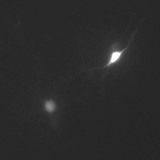
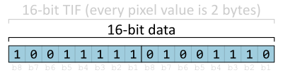
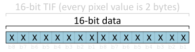
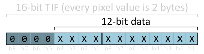
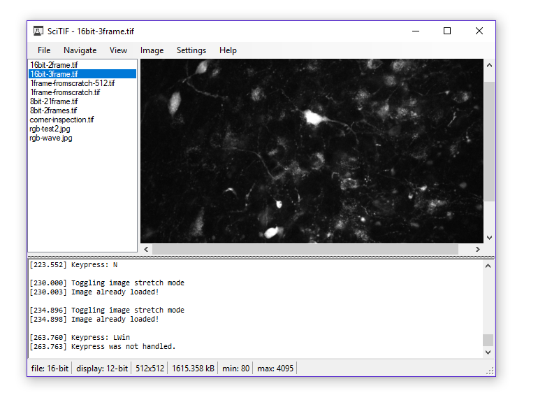

# SciTIF
**SciTIF provides a .NET interface to microscopy data stored in TIF files.** Many TIF libraries already exist, but they often do a bad job handling TIF files used for scientific microscopy. This is especially true when 16-bit TIF files are used to store non-16-bit data (such as from a 12-bit camera) resulting in images falsely appearing black. If you've ever tried to open a microscope TIF in Windows Photo Viewer and been presented with a black square, you've experienced this problem too! 

***SciTIF provides a simple API to access to raw pixel intensity values from TIF files, as well as methods to generate brightness-adjusted bitmaps for displaying or saving in other image formats.***

**SciTIF is specifically written with scientific analysis in mind.** Potential applications include fluorescent microscopy (immunohistochemistry, colocalization assessment, image enhancement, quantitative intensity and ROI analysis), fluorescent videomicroscopy (intensity analysis of time-series calcium-sensitive fluorophores such as Fluo-4 or GCaMP), and quantitative ratiometric analyses of multi-channel images. Since SciTIF was written with quantitative intensity analysis in mind, raw fluorescence intensity read from TIF files is treated as scientific data and transparently handled with careful attention paid to the preservation of its integrity.

## SciTIF Supports Arbitrary Bit Depths
**Many existing TIF-reading .NET libraries (including the standard ones) fail to properly render 16-bit TIFs which contain lower bit depth data.** This is why 16-bit TIF micrographs taken with a 12-bit camera don't render properly in the Windows photo viewer (appearing as black images). SciTIF was developed to provide better support for TIFs generated using scientific imaging devices which save TIF files with nonstandard bit depths.

### 16-bit TIF files use 2 bytes (16 bits) to store pixel intensity

 In this example the pixel value is `0b1001111101001110` (40,782). Since the brightest a pixel could be is `0b1111111111111111` (65,535), this pixel is a light gray and should display at 62.2% (40,782 / 65,535) of its peak brightness (white)

### 16-bit TIFs are often assumed to contain 16-bit data

Most image libraries assume 16-bit TIFs contain 16-bit data. In this example `X` represents a bit position which could be `0` or `1`. A white pixel (100% intensity) is value `0b1111111111111111`. Now consider if we use a 12-bit camera. Since TIFs are limited to have depths which are multiples of 8 (because each byte is 8 bits), 12-bit data doesn't "fit" in the 16-byte TIF.

### Placing lower-bit-depth data in 16-bit TIFs

 

Consider a situation where you have a 12-bit camera. The maximum intensity value a 12-bit camera can produce is `0b0000111111111111` (4095). If displayed on a 16-bit scale, white (100%) becomes dark gray (4,095 / 65,535 = 6.25%). This is why microscope TIFs often look black in image editing programs.

**SciTIF supports any bit depth data placed in any bit depth TIF.** When SciTIF is told "this is 12-bit data", all calculations are performed on a 12-bit scale (irrespective of whether it is a 16-bit, 24-bit, or 32-bit TIF). In cases where the bit depth is unknown, SciTIF can determine camera bit depth automatically by inspecting how many bit positions contain data.

## SciTIF Browser

**The SciTIF browser is a lightweight TIF browser designed to replace the Windows Photo Viewer as the default application for viewing TIFs on computers which frequently work with scientific images.** The SciTIF Browser achieves the simplicity, speed, and navigability of the [Windows Photo Viewer](https://en.wikipedia.org/wiki/Windows_Photo_Viewer) in a scientific application which has the quantitative rigor of ImageJ and FIJI. Every computer which acquires or views TIF files acquired through a microscope can benefit from the SciTIF Browser.

The [Windows Photo Viewer](https://en.wikipedia.org/wiki/Windows_Photo_Viewer) cannot properly display 16-bit TIFs containing pixel intensity data of a different bit depth (10-bit, 12-bit, or 14-bit), resulting in TIFs appearing as near-black images. The Windows Photo Viewer can not even modify brightness and contrast to compensate. Further, an accidental click (such as the rotate button) will modify the original image (considered experimental data in scientific settings) which can be a source of error for the scientist seeking to perform quantitative pixel intensity measurements in the future.

[NIH ImageJ](https://imagej.nih.gov/ij/) and its descendant [FIJI](http://fiji.sc/) can display these images, but they have a steep learning curve, can only open images one at a time (left/right arrow keys do not navigate to other images in the same folder), are extremely large (75 MB and 293 MB zipped), and require the JAVA runtime environment on the client computer.

## Project Status
SciTIF is in ALPHA stage. It is not ready for public use. If you want to poke around the source code, start [here](https://github.com/swharden/SciTIF/tree/master/src/SciTifLib)

## Features
* Scientific-level (not photo-level) attention to preservation of pixel intensity values
* Supports arbitrary bit depth (e.g., 10-bit, 12-bit, and 14-bit) data in TIFs of all bit depths
* Images from stacks are pulled from disk (not memory) so your 200 GB TIFs are supported
* Open source and readable code so you can inspect what is being done to your data
* Intuitive API does not require documentation if you use a predictive IDE
* not JAVA

## Resources
* [TIFF File Format Summary](https://www.fileformat.info/format/tiff/egff.htm#TIFF.FO)
* [TIFF Tag Descriptions](https://www.awaresystems.be/imaging/tiff/tifftags/baseline.html)
* [Pillow TIFF decoder source code](https://github.com/imagej/ImageJA/blob/master/src/main/java/ij/io/TiffDecoder.java)
## Contact
**Scott W Harden, DMD, PhD**\
[Harden Technologies, LLC](http://tech.SWHarden.com)\
[www.SWHarden.com](http://www.SWHarden.com)\
[SWHarden@gmail.com](mailto:swharden@gmail.com)
