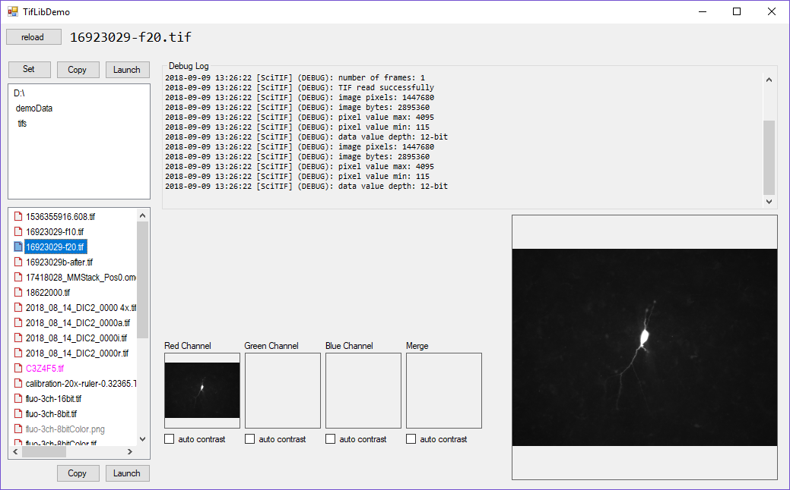

# SciTIF

**SciTIF provides a .NET interface to microscopy data saved in TIF files.** Many TIF file reading libraries already exist, however it is not always clear how they treat uncommon TIF formats which are commonly used in _scientific_ microscopy (e.g., mult-channel multi-layer stacks of 12-bit data arranged little endian in a 16-bit TIF files). 

**An extremely common limitation of existing libraries is the lack of ability to scale a display LUT to nonstandard bit depths.** Most TIF libraries scale to 8-bit, 16-bit, and 32-bit images. However, scientific cameras attached to microscopes typically produce 10-bit, 12-bit, and 14-bit images. One example of a poor TIF library is the one used by Windows to produce thumbnails in Explorer, which presents 16-bit TIFs containing 12-bit data as nearly black images.

**A secondary purpose of this library is to demonstrate how to write scientific-grade analysis routines which read fluorescence intensity directly out of the binary structure of TIF files** (which should be regarded scientifically as experimental data and handled with thoughtful consideration). This is highly useful for fluorescennt microscopy (e.g., immunohistochemistry, colocalization assessment, image enhancement) and fluorescennt videomicroscopy (time-series calcium-sensitive fluorophore analysis such as Fluo-4 or GCaMP), especially when quantitative ratiometeric analyses are required. SciTIF is specifically written with scientific analysis in mind, and was created to be easily ported to other programming languages.

## SciTIF Supports Arbitrary Bit Depths
Many existing .NET libraries to load TIF files don't operate well when 16-bit TIFs contain 10-bit, 12-bit, or 14-bit data. In this situation, the upper bytes are partially filled. For example, when a 12-bit camera saves its data in a 16-bit TIF, the resulting image often appears "too dark" because the imaging library assumes the source data always spans the full range (16-bits). To complicate things, source data bit-depth is not a standard TIF file tag, so it cannot always be detected automatically. This is why 16-bit TIF micrographs don't render properly in the Windows photo viewer and often appear as black images.

## Project Status
SciTIF is in ALPHA stage. It is not ready for public use. If you want to poke around the source code, start [here](https://github.com/swharden/SciTIF/tree/master/src/SciTifLib)

## Features
* Scientific-level (not photo-level) attention to preservation of pixel intensity values
* Designed for partially-filled pixel byte data (e.g., 12-bit image data saved as a 16-bit TIF)
* TIFs are never fully-loaded into memory (analyzing 100GB TIF stacks is no problem)
* Open source and easy to read, so you can track every operation done to your data
* Intuitive API does not require documentation if you use a predctive API
* not JAVA

## Resources
* [TIFF File Format Summary](https://www.fileformat.info/format/tiff/egff.htm#TIFF.FO)
* [TIFF Tag Descriptions](https://www.awaresystems.be/imaging/tiff/tifftags/baseline.html)
* [Pillow TIFF decoder source code](https://github.com/imagej/ImageJA/blob/master/src/main/java/ij/io/TiffDecoder.java) (Java)
## Contact
**Scott W Harden, DMD, PhD**\
[Harden Technologies, LLC](http://tech.SWHarden.com)\
[www.SWHarden.com](http://www.SWHarden.com)\
[SWHarden@gmail.com](mailto:swharden@gmail.com)
